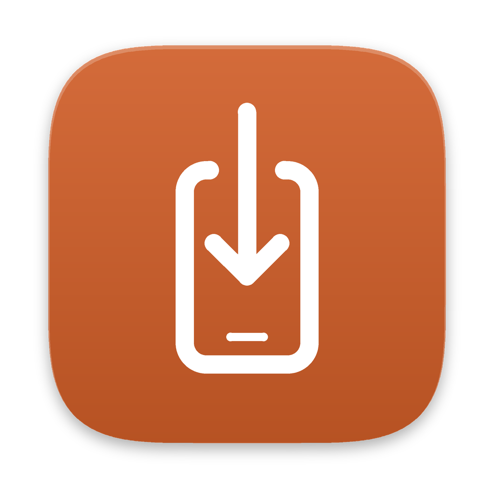
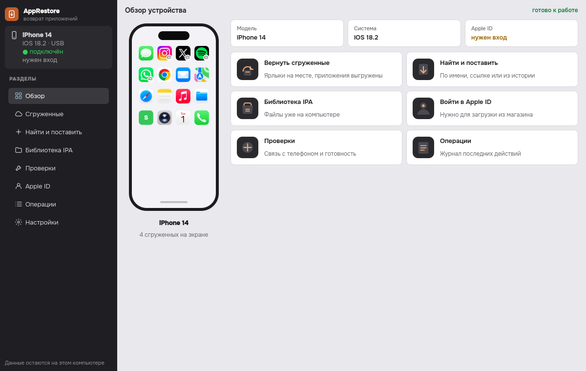
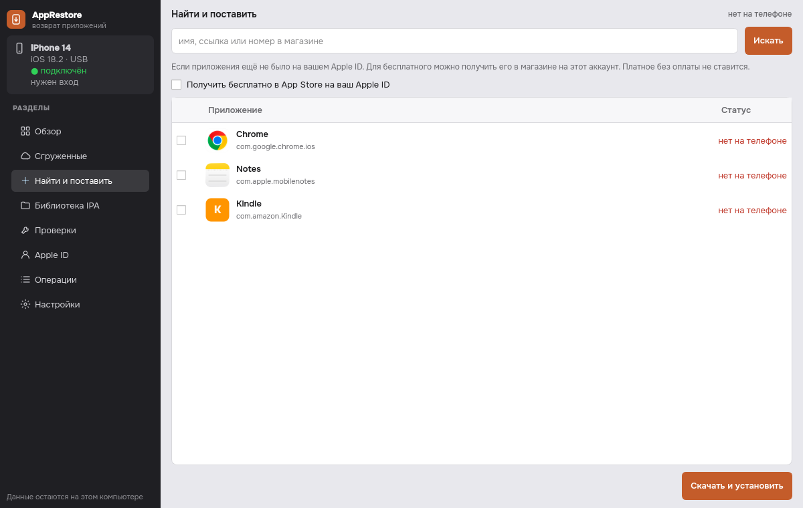

<p align="center">
  
</p>

<h1 align="center">AppRestore</h1>

<p align="center">
  Возвращает на iPhone сгруженные и удалённые приложения.<br>
  Windows и macOS · iPhone по USB · ваш Apple ID
</p>

<p align="center">
  <a href="https://github.com/J3ckJ/AppRestore/actions/workflows/ci.yml"></a>
  <a href="https://github.com/J3ckJ/AppRestore/releases/latest"></a>
  <a href="./LICENSE"></a>
</p>

> **Статус:** beta · Версия 0.3.2. Windows и macOS · проект не связан с Apple Inc.

## Что это

Бывает, что iPhone сам выгрузил приложение, чтобы освободить место, а в
App Store кнопки «Загрузить» уже нет: приложение убрали из магазина или оно
недоступно в вашей стране. AppRestore помогает вернуть такое приложение.

- **Сгруженные** (ярлык на экране остался, а самого приложения нет):
  программа просит iPhone докачать их сам, а если не выходит, скачивает
  через ваш Apple ID и ставит.
- **Удалённые** (ярлыка уже нет): найдите приложение по имени, ссылке
  `apps.apple.com` или номеру в App Store, и программа его поставит.
- **Свои файлы IPA**: если у вас сохранён файл приложения, его можно
  поставить на телефон.

Всё работает на вашем компьютере. Нужны кабель USB и ваш Apple ID. Защита
приложений (DRM) не обходится: ставится только то, на что у вашего Apple ID
есть право.



## Скачать

Все файлы лежат на странице
[последнего выпуска](https://github.com/J3ckJ/AppRestore/releases/latest).
Есть две версии, выберите одну.

### Графическая версия (для всех, без командной строки)

Обычная программа с окном и кнопками. Python и терминал не нужны, всё нужное
уже внутри.

| Система | Файл |
|---|---|
| Windows 10/11 (64 бит) | [AppRestore-GUI-Windows.zip](https://github.com/J3ckJ/AppRestore/releases/latest/download/AppRestore-GUI-Windows.zip) |
| macOS на Apple Silicon (M1 и новее) | [AppRestore-GUI-macOS.zip](https://github.com/J3ckJ/AppRestore/releases/latest/download/AppRestore-GUI-macOS.zip) |

На Mac с процессором Intel графическая версия не запустится. Используйте
терминальную версию.

### Терминальная версия

Меню в окне терминала. Подходит, если вам удобна командная строка, нужен Mac
с Intel или вы хотите запускать команды из скриптов. Ставится одной командой.

| Система | Файл |
|---|---|
| Windows 10/11 | [install.ps1](https://github.com/J3ckJ/AppRestore/releases/latest/download/install.ps1) |
| macOS (Apple Silicon и Intel) | [install.sh](https://github.com/J3ckJ/AppRestore/releases/latest/download/install.sh) |

Как поставить, написано ниже, в разделе
[Установка терминальной версии](#установка-терминальной-версии).

Контрольные суммы SHA-256 всех файлов лежат в
[SHA256SUMS.txt](https://github.com/J3ckJ/AppRestore/releases/latest/download/SHA256SUMS.txt).

## Что нужно

- компьютер с **Windows 10/11 (64 бит)** или **macOS**;
- iPhone и кабель **USB**. Экран телефона разблокирован, на вопрос «Доверять
  этому компьютеру?» ответьте **Доверять**;
- интернет;
- Apple ID, на котором это приложение уже было (покупалось или скачивалось),
  либо свой файл IPA. Бесплатное приложение можно получить на Apple ID прямо
  из программы.

## Графическая версия

### Windows

1. Скачайте [AppRestore-GUI-Windows.zip](https://github.com/J3ckJ/AppRestore/releases/latest/download/AppRestore-GUI-Windows.zip).
2. Распакуйте архив в свою папку, например `C:\Users\<вы>\AppRestore`.
   Не кладите программу в `Program Files`: оттуда не работает обновление в
   один клик, у программы нет прав заменить свои файлы.
3. Проверьте, что архив не подменён. Сборка не подписана для Windows,
   поэтому система её не знает и проверить её можете только вы. В PowerShell
   выполните `Get-FileHash -Algorithm SHA256 .\AppRestore-GUI-Windows.zip` и
   сравните результат со строкой этого файла в
   [SHA256SUMS.txt](https://github.com/J3ckJ/AppRestore/releases/latest/download/SHA256SUMS.txt).
   Если не совпадает, не запускайте программу.
4. Запустите `AppRestore.exe`. Если появится синее окно Windows SmartScreen
   «Система Windows защитила ваш компьютер», нажмите **Подробнее**, затем
   **Выполнить в любом случае**. Окно появляется потому, что у программы нет
   подписи издателя.

### macOS

1. Скачайте [AppRestore-GUI-macOS.zip](https://github.com/J3ckJ/AppRestore/releases/latest/download/AppRestore-GUI-macOS.zip).
2. Проверьте, что архив не подменён. Сборка не подписана и не нотаризована
   Apple, поэтому macOS её не знает и проверить её можете только вы. В
   «Терминале» выполните `shasum -a 256 ~/Downloads/AppRestore-GUI-macOS.zip`
   и сравните результат со строкой этого файла в
   [SHA256SUMS.txt](https://github.com/J3ckJ/AppRestore/releases/latest/download/SHA256SUMS.txt).
   Если не совпадает, не открывайте программу.
3. Откройте архив и перенесите `AppRestore.app` в папку «Программы».
4. При первом запуске macOS скажет, что не может проверить программу, и не
   откроет её. Откройте «Системные настройки», раздел «Конфиденциальность и
   безопасность», прокрутите вниз и нажмите **Всё равно открыть** рядом с
   AppRestore. В старых версиях macOS можно вместо этого щёлкнуть по программе
   правой кнопкой мыши и выбрать **Открыть**.

### Как пользоваться

1. Подключите iPhone кабелем, разблокируйте его и нажмите **Доверять**.
2. Откройте AppRestore. На экране «Обзор» появится ваш телефон.
3. Откройте раздел **Apple ID** и войдите. Если Apple пришлёт код, введите его
   в том же окне. Пароль программа не сохраняет.
4. Раздел **Сгруженные**: отметьте приложения и нажмите **Восстановить**.
   Экран телефона лучше держать разблокированным.
5. Раздел **Найти и поставить**: введите название, ссылку или номер
   приложения в App Store, отметьте нужное и нажмите **Скачать и установить**.



Галочка **«Получить бесплатно в App Store на ваш Apple ID»** нужна, если
бесплатного приложения ещё не было на вашем Apple ID. Тогда программа сначала
получит его в App Store на ваш аккаунт, как кнопка «Загрузить» в магазине.
По умолчанию галочка выключена. Платные приложения так не ставятся.

Если телефон не виден, откройте раздел **Проверки**: там видно, чего не хватает.

### Обновление

«Настройки» → **Проверить обновления**. Программа покажет, что нового, и
спросит разрешения. После нажатия **Обновить** она скачает новую версию,
проверит её контрольную сумму, закроется, заменит себя и запустится снова.
Если новая версия не запустится, вернётся прежняя.

Обновление в один клик не работает, если программа лежит в `Program Files`
(Windows) или в другой папке, куда нельзя писать без прав администратора. В
этом случае скачайте новый архив со страницы выпуска и замените папку вручную.

## Установка терминальной версии

Установщик скачивает архив с исходным кодом нужной версии, сверяет его
контрольную сумму SHA-256 и ставит AppRestore только для вашего пользователя,
без прав администратора. Вместе с ним ставится проверенный **ipatool 2.6.0**.

### Windows (одна строка в PowerShell)

```powershell
irm https://github.com/J3ckJ/AppRestore/releases/latest/download/install.ps1 | iex
apprestore
```

### macOS (одна строка в «Терминале»)

```bash
curl -fsSL https://github.com/J3ckJ/AppRestore/releases/latest/download/install.sh | /bin/bash && export PATH="$HOME/.local/bin:$PATH"
apprestore
```

### Сначала посмотреть установщик и проверить сумму

**Windows:**

```powershell
$installer = Join-Path $env:TEMP "apprestore-install.ps1"
Invoke-WebRequest `
  -Uri "https://github.com/J3ckJ/AppRestore/releases/latest/download/install.ps1" `
  -OutFile $installer
Get-FileHash -Algorithm SHA256 -LiteralPath $installer
notepad $installer
& $installer
apprestore
```

Сверьте сумму с `SHA256SUMS.txt` того же выпуска.

**macOS:** скачайте `install.sh` и `SHA256SUMS.txt` со страницы выпуска,
проверьте `shasum -a 256 install.sh`, прочитайте скрипт и запустите его.

### Из исходного кода выпуска

```powershell
.\install-windows.ps1
apprestore
```

```bash
./install-macos.sh && export PATH="$HOME/.local/bin:$PATH"
apprestore
```

**Обновление терминальной версии:** выполните ту же команду установки ещё раз.
Установщик сначала собирает новую версию отдельно и только потом заменяет
старую.

### Как пользоваться терминальной версией

1. Подключите iPhone по USB, разблокируйте его и нажмите **Доверять**.
2. Запустите `apprestore` без параметров: откроется меню.
3. **A**: вход в Apple ID. **B**: проверка и установка нужных компонентов
   (`doctor` и `setup`).
4. **1**: сгруженные приложения (ярлык остался на экране).
5. **2**: удалённые приложения без ярлыка (поиск по имени, номеру в App Store
   или ссылке).

Команды:

```text
apprestore --version
apprestore doctor
apprestore devices
apprestore offloaded
apprestore missing
apprestore auth --email you@example.com
apprestore search "название"
apprestore download com.example.app
apprestore download --store-id 1234567890
apprestore install path\to\app.ipa
apprestore restore
apprestore restore-missing
apprestore restore-missing --store-id 1234567890
```

Флаг `--acquire-license` разрешает получить бесплатное приложение на ваш
Apple ID (`ipatool --purchase`). Без него программа ничего не получает в
магазине сама.

На Windows драйвер Apple для USB ставится командой `apprestore setup`, если
`apprestore doctor` его не находит.

## Частые вопросы

**Телефон не виден.** Проверьте кабель, разблокируйте экран и нажмите
«Доверять этому компьютеру». В графической версии откройте раздел «Проверки»,
в терминальной выполните `apprestore devices` и `apprestore doctor`. На
Windows нужен драйвер Apple для USB: поставьте приложение «Устройства Apple»
(Apple Devices) или iTunes, либо выполните `apprestore setup`.

**Apple просит код.** Это обычная двухфакторная защита. В графической версии
после пароля появится поле для кода из 6 цифр, в терминальной код вводится там
же, где пароль. Вводите самый свежий код: код от прошлой попытки Apple не
примет и завершит вход. Если код не пришёл, не входите заново несколько раз
подряд, Apple может перестать присылать коды. Возьмите код на iPhone:
«Настройки» → ваше имя → «Вход и безопасность» → «Получить код проверки».
AppRestore не записывает пароль и код в журнал.

**Спрашивают «пароль связки ключей».** Это не пароль Apple ID. Его спрашивает
ipatool на Windows, чтобы зашифровать сохранённый вход. Придумайте его при
первом входе и вводите тот же при следующих. Графическая версия спрашивает
его один раз при запуске.

**Первый вход в Apple ID долго молчит.** При первом входе ipatool скачивает
служебный компонент. Подождите несколько минут.

**Приложения больше нет в App Store.** Если оно было на вашем Apple ID, часто
помогает поиск по номеру приложения или по ссылке на его страницу. Иначе
нужен свой сохранённый файл IPA.

**Поиск удалённых приложений по названию.** Если App Store, ваши покупки и
встроенный список ничего не нашли, AppRestore ищет приложение в публичном
архиве. Поиск удалённых приложений идёт через публичный архив Internet Archive
(web.archive.org). Туда отправляется только текст запроса, ваш Apple ID — нет.
Выключить это можно в «Настройках», переключатель «Искать в архиве».

**Ошибка сети при входе.** Проверьте подключение к интернету и попробуйте ещё
раз. Если вы выходите в сеть через прокси, AppRestore использует системные
настройки; явные `HTTP_PROXY` и `HTTPS_PROXY` всегда важнее.

## Безопасность и приватность

- пароль Apple ID, код и пароль связки ключей не передаются в параметрах
  командной строки и не записываются в журнал;
- в репозиторий и выпуски не попадают ваши IPA, резервные копии и данные
  телефона;
- на компьютере остаются: сама программа, служебные файлы ipatool, папка с
  файлами IPA и небольшой список найденных номеров приложений;
- получить приложение в App Store на ваш Apple ID программа может только с
  вашего разрешения (галочка в окне или флаг `--acquire-license`);
- не прикладывайте к сообщениям об ошибке файлы IPA, UDID, почту, пароли и
  полные журналы.

Подробнее: [SECURITY.md](./SECURITY.md).

## Ограничения

- только законный путь: ваш Apple ID и ваши файлы IPA;
- защита приложений (DRM) не обходится, пиратские IPA не поддерживаются;
- графическая версия для macOS работает только на Apple Silicon и не подписана
  в Apple;
- сборки для Windows не подписаны, поэтому SmartScreen показывает
  предупреждение;
- Linux не поддерживается;
- вернуть приложение, которое убрали из магазина, получится, только если Apple
  ещё отдаёт его вашему Apple ID;
- это beta: смотрите последний выпуск и [список изменений](./CHANGELOG.md).

## Лицензия и сторонние компоненты

AppRestore распространяется по лицензии [GNU GPL v3](./LICENSE).

Главные компоненты:

- **ipatool 2.6.0** (MIT): вход в Apple ID и загрузка IPA;
- **pymobiledevice3**: связь с iPhone по USB;
- **PySide6 (Qt)**: окно графической версии;
- **Unicorn 2.1.4**: служебный компонент, который ipatool скачивает сам при
  первом входе.

Полный список и суммы SHA-256: [THIRD_PARTY_NOTICES.md](./THIRD_PARTY_NOTICES.md).

## Участие и выпуск

- как помочь проекту: [CONTRIBUTING.md](./CONTRIBUTING.md);
- как выпускать новую версию: [docs/RELEASING.md](./docs/RELEASING.md);
- история изменений: [CHANGELOG.md](./CHANGELOG.md).

В каждом выпуске шесть файлов: `AppRestore-GUI-Windows.zip`,
`AppRestore-GUI-macOS.zip`, `install.ps1`, `install.sh`,
`AppRestore-<версия>-source.zip` и `SHA256SUMS.txt`.

---

## English summary

**AppRestore** brings offloaded or deleted apps back to an iPhone over USB from
Windows or macOS, using your own Apple ID and the verified **ipatool 2.6.0**.
It does not bypass DRM.

Download from
[the latest release](https://github.com/J3ckJ/AppRestore/releases/latest):

- **Desktop app (no command line):**
  [Windows](https://github.com/J3ckJ/AppRestore/releases/latest/download/AppRestore-GUI-Windows.zip),
  [macOS, Apple Silicon](https://github.com/J3ckJ/AppRestore/releases/latest/download/AppRestore-GUI-macOS.zip).
  Both builds are unsigned (and not notarized by Apple), so first compare the
  archive's SHA-256 (`Get-FileHash` on Windows, `shasum -a 256` on macOS) with
  [SHA256SUMS.txt](https://github.com/J3ckJ/AppRestore/releases/latest/download/SHA256SUMS.txt).
  Then on Windows click **More info**, then **Run anyway**; on macOS open
  System Settings, Privacy & Security, and click **Open Anyway**.
- **Terminal version:**

```powershell
irm https://github.com/J3ckJ/AppRestore/releases/latest/download/install.ps1 | iex
```

```bash
curl -fsSL https://github.com/J3ckJ/AppRestore/releases/latest/download/install.sh | /bin/bash
```

Then run `apprestore`, trust the computer on the phone, use menu item **A** to
sign in, **1** for offloaded apps, **2** for fully removed apps. Passwords stay
inside interactive `ipatool`; AppRestore does not put them on argv. See
`apprestore --help` and [SECURITY.md](./SECURITY.md).
