# AppRestore 4b · Спецификация, часть 1: токены и главный экран

Для Qt Quick (QML) + Python-модели. Источник правды: `design/concepts/variant-4b.html` (+ `src/v4b.py`), окно выбора и онбординг: `variant-4b-picker.html`, `variant-4b-onboarding.html`.
Все размеры в **логических px**. Токены: `tokens.json`, готовый синглтон `Theme.qml` (рядом).
Пометки: **[макет]** = значение из CSS; **[предл.]** = моё предложение, в макете нет; **[нет в коде]** = в repo/feat/ui-4b такого нет.

Рендеры-эталоны (2880×1800, окно 1392×852 на подложке 1440×900):
`variant-4b-missing.png`, `-installing.png`, `-done.png`, `-disconnected.png`, `-error.png` (вход), `-region.png`, `-store-mismatch.png`, `-store-mismatch-final.png`, `-needs-component.png` (ipatool без патча), `-picker-main500.png` (много), `-missing-windows.png`, сводка `-states.png`.

---

## 1. Токены

### 1.1 Цвета

| Токен | Hex | Где |
|---|---|---|
| `bg` | `#EBEAE6` | фон окна |
| `card` | `#FFFFFF` | плашка статуса, вторичная кнопка, лист |
| `surfaceSoft` | `#F3F2EE` | поле поиска, левая колонка листа (часть 2) |
| `ink` | `#121212` | основной текст, цифра, тёмные элементы |
| `ink2` | `#61605C` | вторичный текст, ссылки, подпись lead |
| `ink3` | `#97958F` | подпись «не хватает» у цифры (крупно), декоративное |
| `ink3Text` **[предл.]** | `#77756F` | мелкий вторичный текст (hint/fine), см. §5: `ink3` не проходит контраст |
| `line` | `#D6D4CE` | обводка плашки и вторичной кнопки, разделители очереди |
| `track` | `#D3D1CA` | пустая дорожка этапов |
| `accent` | `#B35128` | главная кнопка, текущий этап. Решение Лены/Макса 10.10: было #C45A2C (белый 4.33:1), стало #B35128 — белый 5.09:1, AA для любого кегля. Иконка AppRestore (картинка) не меняется |
| `accentHover` | `#A34A24` | hover (акцент × 0.91; белый 5.90:1) |
| `accentPressed` | `#934221` | pressed (акцент × 0.82; белый 6.90:1) |
| `accentDisabled` | `#D9D7D1` | disabled (из листа «Что вернуть», `.go.dis`), текст белый |
| `ok` | `#2F9E55` | точка «подключён» |
| `okText` **[предл.]** | `#217A40` | текст «На iPhone» в очереди (в макете `ok`, мало контраста) |
| `off` | `#A3A29D` | точка «не подключён» |
| `iosNew` | `#0A84FF` | синяя точка нового приложения на телефоне |
| `wall` | `#DDD8CC` | обои телефона (плоские) |
| `screenOff` | `#1F1F21` | выключенный экран (disconnected) |
| `phoneFrame` / `phoneFrameEdge` / `phoneBezel` | `#1B1B1D` / `#38383B` / `#0B0B0B` | корпус |
| `slotDash` | `#000` α .32 | пунктир пустого места |
| `veil` | `#000` α .45 | затемнение иконки под круговым прогрессом |

Кнопки, состояния:

| Кнопка | normal | hover | pressed | disabled | focus |
|---|---|---|---|---|---|
| Главная `PrimaryButton` | bg `accent`, текст `#FFF` | `accentHover` | `accentPressed` | bg `accentDisabled`, текст `#FFF`, без курсора-руки | кольцо 2px `ink`, отступ 3px + внутр. 1px `#FFF` |
| Вторичная `SecondaryButton` («Готово», «Проверить снова») | bg `card`, рамка 1px `line`, текст `ink` | bg `surfaceSoft` | bg `#E6E4DE` [предл.] | текст `ink3`, рамка `line` | то же кольцо |
| Тихая ссылка `QuietLink` | `ink2` | `ink` + подчёркивание 1px, отступ 2px | `ink` | `ink3` | кольцо 2px `ink`, радиус 6, отступ 2px |

### 1.2 Шрифты

| ОС | Текст | Крупное (цифра, display) |
|---|---|---|
| macOS | системный (`.AppleSystemUIFont` → SF Pro Text) | SF Pro Display (система выбирает по размеру) |
| Windows | `Segoe UI Variable Text` → `Segoe UI` | `Segoe UI Variable Display` → `Segoe UI` |
| Запасной | **Inter** (OFL) в бандле, если нет системных | Inter |

Счётчики, проценты, размеры: табулярные цифры, `font.features: {"tnum": 1}` (Qt ≥ 6.6; на старом Qt допустимо без них). Веса 550/650 есть в макете: в Qt 6 `font.weight` принимает 1–1000; у SF/Segoe Variable они есть, у статичных Segoe округлятся до 600.

Межбуквенный интервал: в CSS был в em, ниже уже переведён в px (`font.letterSpacing`). Межстрочный: `lineHeightMode: Text.FixedHeight`.

| Стиль | Размер | Вес | Строка | Трекинг | Где |
|---|---|---|---|---|---|
| `numeralXL` | 300 | 700 | 216 (.72) | −19.5 | цифра 1–2 знака |
| `numeralL` | 250 | 700 | 180 | −16.25 | 3 знака (`picker.html .num.col`) |
| `numeralM` | 190 | 700 | 137 | −12.35 | installing «2» |
| `numeralCaption` | 38 | 650 | 40 | −0.95 | «приложения / не хватает» |
| `numeralCaptionM` | 32 | 650 | 34 | −0.8 | «из 4 / уже на iPhone» |
| `display` | 84 | 700 | 81 (.96) | −3.78 | «Всё на месте», «Подключите iPhone», «Войдите…» |
| `lead` | 22 | 400 | 31 (1.4) | −0.11 | абзац; выделения `<b>` → 600, `ink` |
| `step` | 21 | 400 | 28 | −0.21 | шаги подключения |
| `button` | 21 | 650 | — | −0.21 | главная кнопка |
| `brand` | 17 | 650 | 22 | −0.17 | «AppRestore» |
| `rowTitle` | 16.5 | 600 | 22 | 0 | очередь |
| `overline` | 15 | 700 | 20 | 0 | надзаголовок |
| `link` | 15 | 500 | 20 | 0 | тихие ссылки |
| `fine` / hint | 14.5 | 400 | 21.75 | 0 | пояснения под кнопкой |
| `pill` | 14 | 550 | 18 | 0 | плашка статуса |
| `rowMeta` | 13.5 | 450 | 18 | 0 | «351 МБ» |
| `stageLabel` | 12.5 | 600 | 16 | 0 | «Скачано / Установка / Готово» |
| `phoneLabel` | 12.5 | 500 | 16 | 0 | подписи на телефоне |

Цифра: левый отступ `-0.06em` = **−18 px** при 300 (оптическое выравнивание вертикали «4» по левому краю колонки).

### 1.3 Отступы, радиусы, линии, тени

Шкала (реально используемые): 4 · 7 · 8 · 9 · 12 · 14 · 16 · 20 · 22 · 26 · 28 · 30 · 34 · 46 · 76 (`padX`).

| Радиус | px | | Линия | px |
|---|---|---|---|---|
| плашка | 999 (полукруг) | | разделители, рамки | 1 |
| главная кнопка | 18 (Windows 8) | | пунктир пустого места | 2, штрих 3, зазор 3 (по `dashPattern` в единицах толщины) |
| иконка на телефоне | 17 (при 74) | | кольцо кругового прогресса | 2.5 |
| иконка в очереди | 9 (при 40) | | фокус | 2 |
| дорожка этапа | 3 | | | |
| окно | 12 mac / 8 win (рисует ОС) | | | |

Тени: окна рисует ОС. Корпус телефона: `0 1 2 α.18` + `0 12 28 −14 α.35` **[макет]**: в QML через `MultiEffect` (shadowEnabled, blur ≈ .3, verticalOffset 12, opacity .35) или без тени, если тяжело; телефон обрезан снизу, тень почти не видна. Других теней на главном экране нет.

### 1.3a Шрифты macOS / Windows — единая таблица

Источник истины — `Theme.typeMac` / `Theme.typeWin` (и `tokens.json → font.typeMac/typeWin`), выбор `Theme.type` по `Qt.platform.os`. Полная таблица по всем стилям частей 1–4 — в `02-picker.md`, §7. Правила для Windows: те же px; трекинг крупного кегля слабее (−0,065em → −0,055em, −0,045em → −0,035em, −0,025em → −0,02em); текст мельче 13 px → 13 px (ClearType); на Windows 10 (нет Segoe UI Variable) веса 450→400, 550/650→600 через `Theme.weightFor()`.

### 1.3b Тёмная тема — решение

- **В v1 не входит. Приложение принудительно светлое**: системная тёмная тема macOS/Windows игнорируется (`Theme.palette = light`; в Qt Quick Controls — не наследовать системную палитру, фон окна задаём сами).
- Токены цвета **семантические** (`bg`, `ink`, `ink2`, `accent`, `sheet`, `rowOn`, …). В QML-компонентах **нет ни одного hex** — только `Theme.<имя>`; проверка в ревью: `rg '#[0-9a-fA-F]{6}' qml4b/components` должен быть пуст (у Димы сейчас hex живут в `theme/Theme.qml` — это правильно).
- Чтобы после v1 добавить тёмную: объект `dark` с теми же ключами + переключение `Theme.palette`. Компоненты не меняются. Исключения, которые в тёмной теме НЕ меняются: макет iPhone (`phoneFrame`, `wall`, `iosAlert*`) — это изображение телефона, а не UI программы.

### 1.4 Движение **[предл.]**

| Что | Длительность | Кривая | Как |
|---|---|---|---|
| Смена состояния экрана | 180 | InOutCubic | кроссфейд левой колонки (opacity), телефон не двигается |
| Пустое место → иконка | 240 | OutCubic | иконка scale .92→1 + opacity 0→1 поверх пунктира; пунктир opacity 1→0 за 150 |
| Круговой прогресс | значение сглаживать 200 | Linear | `Behavior on progress { NumberAnimation }`; неопределённый (−1) — сектор 25%, вращение 1200 мс/оборот |
| Пустое место → «Ожидание» → «загрузка» | 150 | OutCubic | opacity иконки .35 → .55, затем вуаль |
| Синяя точка нового | 150 | OutCubic | появляется после «Готово» (opacity) |
| Цифра (4→3, 2→3) | 220 | OutCubic | старое значение уходит вверх на 12 px + opacity, новое приходит снизу |
| Точка плашки серый↔зелёный | 150 | Linear | `ColorAnimation` |
| Hover/pressed кнопки | 120 | OutCubic | `ColorAnimation` |

Системная настройка «уменьшить движение» (macOS Reduce Motion / Windows «Анимация в Windows» выкл.): все переходы становятся мгновенными, кроме прогресса.

---

## 2. Главный экран: сетка и компоненты

### 2.1 Сетка (база: окно 1392×852 из макета; на 1440×900 те же отступы от краёв)

```
┌────────────────────────────────────────────────────────────────────┐
│ ●●● (mac 16,16)                                      [— ☐ ✕] (win)  │
│  padX=76                                                 padX=76    │
│  [icon34]  AppRestore          (top=52, h=36)        ( ● iPhone… )  │
│                                                                      │
│  hero: x=76, y=150, w=620              phone: right=156, top=128     │
│  overline                               w=430, h=881 (2.05·w)        │
│  ЦИФРА + подпись                        обрезан нижним краем окна    │
│  lead (max 540)                                                      │
│  [ Главная кнопка ]  (h=68)                                          │
│  hint                                                                │
│  ссылки · ссылки · ссылки                                            │
└────────────────────────────────────────────────────────────────────┘
```

| Блок | x | y | w | Привязка при ресайзе |
|---|---|---|---|---|
| Светофор mac | 16 | 16 | 12×12, шаг 8 | нативный (не рисовать; `Qt.ExpandedClientAreaHint`/нативная рамка) |
| Шапка | padX | 52 | до padX справа, h 36 | лево/право |
| Hero (левая колонка) | padX | 150 | 620 | слева, вертикально фиксировано |
| Телефон | W−156−430 | 128 | 430 | справа; низ режется окном |

Ресайз **[предл.]**:
- Минимум окна **1180×760**.
- `phoneW = clamp(360, 430, 0.309·W)`; правый отступ = `156·W/1392`; top 128 фиксирован; всё ниже края окна обрезается (`clip: true` у корня).
- `heroWidth = min(620, W − padX − phoneW − rightMargin − 48)`; lead переносится.
- При H < 820 hero.top = 120. Сам телефон по высоте не масштабировать: он и задуман обрезанным.
- Шире 1440: свободное место уходит в просвет между колонками, ничего не растягивается.

### 2.2 Компоненты

| QML-компонент | Свойства | Размеры / стиль [макет] | Примечание QML |
|---|---|---|---|
| `AppHeader` | `os: string` | иконка 34×34 (`assets/apprestore-icon.png`), зазор 12, `brand` | Иконка — реальная из `packaging/icons` |
| `StatusPill` | `connected: bool`, `text: string` | h 36, padding L14 R16, радиус 999, фон `card`, рамка 1px `line`; точка 9×9 `ok`/`off`, зазор 9; `pill`; при `!connected` текст `ink2` | Тексты: «iPhone подключён» / «iPhone не подключён» (`session.deviceNoun` для iPad). Привязка: `connected: session.connected` |
| `Overline` | `text` | `overline`, `ink`; вторая часть (если есть) `ink3`, weight 500, отступ 8 | |
| `HeroNumeral` | `value: int`, `line1: string`, `line2: string`, `size: "xl"\|"l"\|"m"` | цифра + подпись справа (зазор 26; у `m` 20), подпись выровнена по низу цифры, отступ снизу 2; line2 цвет `ink3` | см. правила ниже |
| `LeadText` | `text` (RichText, `<b>`) | `lead`, `ink2`, `<b>` → `ink`/600, maxWidth 540, отступ сверху 30 | `textFormat: Text.StyledText` |
| `PrimaryButton` | `text`, `enabled` | h 68, padX 46, радиус 18, `button`, отступ сверху 34 | ширина по тексту |
| `SecondaryButton` | `text` | как Primary, фон `card`, рамка 1px `line` | |
| `HintLine` | `icon: "info"\|"lock"\|"usb"`, `text` | 14.5, `ink3Text`, иконка 14, зазор 7; отступ сверху 14 (hint) / 16 (fine), maxWidth 470 | иконки — SVG-контуры 1.4px (`src/common.py`, `SVG`) |
| `QuietLinks` | `model: [{text, action}]` | в ряд, зазор 30, `link`, `ink2`, отступ сверху 30 | |
| `PhoneHero` | `screenOn: bool`, `tiles: model`, `pages: int` | корпус: см. 2.3 | |
| `HomeTile` | `kind: "app"\|"slot"\|"offloaded"\|"waiting"\|"downloading"\|"installing"\|"new"\|"unavailable"`, `icon: url`, `label`, `progress: real (−1…1)` | 74×74, радиус 17, подпись 12.5/500, зазор 7 | см. 2.4 |
| `InstallQueue` | `model` | ширина 560, строки с разделителями 1px `line` | только в installing |

**HeroNumeral: правила**
- Склонение line1 (n по модулю 10/100): `n%10==1 && n%100!=11` → «приложение»; `n%10∈2..4 && n%100∉12..14` → «приложения»; иначе «приложений». line2 = «не хватает».
- Спорно: «1 приложение не хватает» звучит неграмотно (нужен родительный падеж). Для форм на «-ие» (1, 21, 31…) **[предл.]** line2 = «пропало с iPhone». Решить с Евгением.
- Размер по числу знаков: 1–2 знака → `xl` 300, подпись справа. 3 знака → `l` 250, подпись **под** цифрой (column, зазор 24, подпись 40/650, `picker.html .num.col`). 4+ знака → 190, под цифрой. Ширину проверять `TextMetrics`; если цифра+подпись > heroWidth, сразу переходить в column.
- installing: `value` = готово, line1 = «из {total}», line2 = «уже на iPhone», размер `m`.

**LeadText: правило списка**
- Удалённые, ≤ 4 шт.: «**A, B, C и D** пропали с телефона, их больше нет в App Store. Их можно вернуть.» (дословно из макета; 1 шт.: «**A** пропало с телефона, его больше нет в App Store. Его можно вернуть.» **[предл.]**).
- > 4 имён: «**A, B, C и ещё N**…»; N склонять как «ещё 1 / 2 / 5».
- Имена короткие: Сбер, Т-Банк, ВТБ, Альфа. Брать короткое имя из `trackName` до «:», «—», « - ».
- Много (смешанные группы): «**{off} сгруженных**, {rem} удалённых из App Store и {reg} нет в App Store вашей страны. Все сразу не поместятся: на iPhone свободно {free}.» (`picker-main500`). Хвост «Все сразу не поместятся…» показывать только если сумма известных размеров > свободного места.

**Главная кнопка: правило [параметр `Theme.restoreAllMax = 8` = `ui4b.home.DIRECT_LIMIT`; в черновике было 12 — берём значение из кода]**
- `N ≤ restoreAllMax` **и** `sum(size) ≤ free` (неизвестный размер = 0, но тогда hint «размер части приложений узнаем при скачивании») → «**Вернуть все N**» → сразу installing (очередь = все).
- Иначе → «**Выбрать и вернуть**», hint «Сначала покажем список, отметите нужные.» → лист «Что вернуть» (часть 2).
- Hint для «Вернуть все N»: «Около 5 минут. Телефон не отключайте.» Минуты — **[предл.]** оценка, пока не считается. Без оценки: «Телефон не отключайте.»

**QuietLinks на missing:** «Найти другое приложение» · «Файлы IPA» · «Apple ID».

### 2.3 iPhone (`PhoneHero`), все размеры от `w` = 430

| Деталь | Формула | При 430 |
|---|---|---|
| Корпус | w × 2.05w, радиус .185w, фон `phoneFrame`, внутр. обводка 1px `phoneFrameEdge` | 430×881.5, r 79.6 |
| Безель | inset .014w, радиус .172w, `phoneBezel` | 6, r 74 |
| Экран | inset .047w, радиус .135w, фон `wall` (disconnected: `screenOff`) | 20.2, r 58 |
| Кнопки сбоку | ширина .012w, выступ −.01w; лев.: top 16%/h5%, 25%/9%, 36%/9%; прав.: 28%/14%; цвет корпуса | 5.2 |
| Dynamic Island | top .035w (от экрана), ширина 32% экрана, высота .092w, `#000`, радиус пол-высоты | 15 / 138 / 39.6 |
| Статус-бар | top .05w, padX .1w, шрифт .05w/600, цвет `ink`; батарея .085w × .046w, рамка 1px α.75, заливка 62% | 21.5 px |
| Сетка иконок | top .2w, бока .075w, 4 колонки (space-around по центру ячейки), шаг строки = 74 + 7 + 16 + 26 | top 86, бока 32 |
| Точки страниц | 7×7, зазор 7, активная α.7, остальные α.22 (`picker.html .pdots`), под последним видимым рядом +6 | |

Disconnected: экран `screenOff`, статус-бар и иконки скрыты, остров виден.
В QML корпус проще собрать из `Rectangle` с `radius`, без масок. Экран: `Rectangle { clip: true; radius }`: в Qt 6 скругление клиппинга работает только через `layer.enabled + MultiEffect maskSource` (или `OpacityMask`). Экономнее скруглять каждую иконку отдельно, а экран клиппить прямоугольником: углы закроет безель.

### 2.4 Плитки на телефоне (`HomeTile.kind`)

| kind | Вид [макет] | QML |
|---|---|---|
| `app` | иконка 74, радиус 17, подпись `ink` | `Image { fillMode: PreserveAspectCrop }` + маска-скругление (`MultiEffect.maskEnabled` или иконки сразу кэшировать скруглёнными: `icons_cache.py` уже умеет `QPainterPath`) |
| `slot` (пустое место) | пунктир 2px, штрих/зазор 3/3, `slotDash`, радиус 17, без заливки; подпись `ink2` | **не Rectangle.border** (у него нет пунктира): `Shape { ShapePath { strokeStyle: ShapePath.DashLine; dashPattern: [3,3]; strokeWidth: 2; fillColor: "transparent"; PathRectangle { radius: 17 } } }` (Qt ≥ 6.8). На старом Qt: 4 `PathArc` + `PathLine` |
| `offloaded` (сгружено, много) | иконка opacity .6, перед подписью облачко 11 px | облачко — SVG 16×16 `cloud` из `src/common.py` |
| `waiting` | иконка opacity .35, подпись «Ожидание» | как в iOS |
| `downloading` / `installing` | иконка opacity .55 (в макете `.dim`), вуаль `veil` радиус 17, по центру кольцо r19/2.5px белое + сектор r15 белый | `Shape` + `PathAngleArc { startAngle: -90; sweepAngle: 360*progress }` с `moveToStart` из центра и `PathLine` к центру (сектор). Неопределённый прогресс (−1): сектор 90° + `RotationAnimator` |
| `new` (вернулось) | иконка 1.0, перед подписью точка 6×6 `iosNew`, зазор 4 | |
| `unavailable` (регион) | иконка opacity .3, подпись «Недоступна» `ink3` | |

Иконки и данные:
- **Источник иконки:** `artworkUrl512` через уже существующий `apprestore_gui/icons_cache.py` (`ArtworkCache.lookup`, iTunes Lookup, кэш `cache_dir()/artwork`).
- **Нет иконки:** нейтральный скруглённый квадрат `#D3D1CA` (= `track`), без буквы. В feat/ui-4b `offloaded_card`/`phone_card` отдают `mark` (первая буква) и цветную плитку `_TILES` (в т.ч. `#5E5CE6` фиолетовый): в 4b **не использовать**.
- **Что ставить на экран телефона:** раскладки домашнего экрана нет ни в макете, ни в коде. Дефолт **[предл.]**: сетка из установленных приложений (`session.phoneApps`), 3 ряда установленных + 1 ряд пустых мест (до 4 недостающих, по порядку очереди). Если недостающих > 4: ряды `offloaded` (до 8) + ряд пустых мест удалённых + точки страниц, `pages = ceil(total/24)`, не больше 11. Если `phoneApps` пуст: только пустые места/сгруженные, без «левых» приложений.
- **Синхронно с очередью:** `slot → waiting → downloading(p) → installing → new`. При ошибке по приложению плитка возвращается в `slot`.

---

## 3. Состояния главного экрана

Привязка к коду (feat/ui-4b, только чтение): `session.connected`, `session.authPhase` (`in` / `locked` / `out`), `session.sessionState` (`expired`, …), сигналы `installProgress(int percent, str label)` (percent −1 = неопределённо; ≥100 → label «Ставим на {устройство}»), `installSettled(storeId, ok, message)`, `restoreSettled(message)`. Лицензия: `license_gate.run_with_free_license`, исходы журнала `acquired` / `purchase_uncertain` / `acquired_download_failed`, отказ Apple → `PurchaseRefused` / `LicenseDenied` (не журналируется). Ошибки ipatool: `ipatool_api.ErrorCode` (`TOKEN_EXPIRED`, `NOT_SIGNED_IN`, `TEMPORARILY_UNAVAILABLE`, `APP_NOT_FOUND`, `APPLE_REJECTED`, …).
**−128 «Account Not In This Store»** (исправлено 19:06): в `ipatool_api.ErrorCode` отдельного кода нет; в `ui4b/flow.py` есть `_REFUSAL_128`, но он отправляет −128 в `needs_signin` (как сессию) — **это надо поменять**. Решение: новый `ErrorCode.STORE_MISMATCH` (паттерн `(?<![\w-])-128\b|account not in this store`), **НЕ** в `SESSION_CODES`; шлюз (`license_gate.purchase_outcome`) считает его `refused` (без записи в журнал). Счётчик повторов −128 по `storeId` хранит контроллер (новое поле, в памяти сессии).

| Состояние | Плашка | Overline | Крупно | Lead / тексты (дословно) | Кнопка | Hint / fine | Ссылки | Телефон |
|---|---|---|---|---|---|---|---|---|
| `missing` (мало, N ≤ 8) | зелёная «iPhone подключён» | «iPhone Евгения» (`deviceName`) | `N` + «приложения / не хватает» | «**Сбер, Т-Банк, ВТБ и Альфа** пропали с телефона, их больше нет в App Store. Их можно вернуть.» | «Вернуть все N» | «Около 5 минут. Телефон не отключайте.» (info) | Найти другое приложение · Файлы IPA · Apple ID | 3 ряда `app` + пустые места |
| `missing` (много) | зелёная | «iPhone Евгения» | `519` (`l`, column) + «приложений / не хватает» | «**512 сгруженных**, 4 удалённых из App Store и 3 нет в App Store вашей страны. Все сразу не поместятся: на iPhone свободно 6,8 ГБ.» | «Выбрать и вернуть» | «Сначала покажем список, отметите нужные.» | (как выше) | `offloaded` ×8 + пустые места + точки |
| `installing` | зелёная | «Возвращаю» | `2` (`m`) + «из 4 / уже на iPhone» | очередь (ниже) | нет | «Иконка на телефоне может появиться на минуту позже. Это нормально: ошибки нет, просто подождите.» | Остановить · Журнал | готовые `new`, текущее `downloading/installing`, остальные `waiting` |
| `done` | зелёная | «iPhone Евгения» | display «Всё / на месте» | «**Сбер, Т-Банк, ВТБ и Альфа** снова на телефоне. Вернувшиеся приложения отмечены синей точкой, как обычно в iOS.» | Secondary «Готово» | — | Найти другое приложение · Файлы IPA · Apple ID | все `new` |
| `disconnected` | **серая** «iPhone не подключён», текст `ink2` | «iPhone не найден» | display «Подключите / iPhone» | шаги 1–3: «Соедините телефон с компьютером кабелем» · «Разблокируйте iPhone» · «Нажмите «Доверять» и введите код телефона» | нет (ждём сами) | — | Не получается подключить | экран выкл. |
| `error-signin` | зелёная | «Остался один шаг» | display «Войдите / в Apple ID» | «Сбер, Т-Банк, ВТБ и Альфа есть только на серверах Apple. Скачать их можно на **ваш** Apple ID, поэтому нужен вход.» | «Войти» | (lock) «Вход хранится только на этом компьютере, в связке ключей под вашим паролем. Код подтверждения придёт на ваши устройства Apple.» | Поставить из файла на компьютере… · Почему это безопасно | пустые места |
| `error-store-mismatch` (−128, первый раз) | зелёная | «{Имя} не скачалась» | display «Магазин / не совпал» | «Магазин в текущем входе не совпадает со страной вашего Apple ID.» | «На главный» + вторичная «Войти заново» | (info) «После входа ничего не начнётся само: нажмите «Вернуть» ещё раз.» | — | пустые места |
| `error-store-final` (−128 повторился после нового входа) | зелёная | «{Полное имя}» | display «{Имя} / недоступна» | «Приложение недоступно в магазине страны вашего Apple ID. Остальные приложения можно вернуть как обычно.» | «На главный» (входа нет) | — | Поставить из файла на компьютере… | как region: пустые места + `unavailable` у этого приложения; в списке «Что вернуть» строка переходит в группу «Нет в App Store вашей страны» с той же подписью |
| `error-region` | зелёная | «Альфа недоступна» | `3` + «из 4 / можно вернуть» | «**Сбер, Т-Банк и ВТБ** вернутся как обычно. Альфа-Банка нет в App Store вашей страны, и Apple не отдаёт его этой учётной записи.» | «Вернуть 3» | — | Поставить из файла на компьютере… · Подробнее (решение Лены 10.10: «Войти с другим Apple ID» / «Сменить Apple ID» отложено; ни «купить в другой стране», ни «сменить регион», ни VPN) | пустые места + `unavailable` |
| `needs-component` (ipatool без патча, §3.2) | зелёная | `deviceName` | `N` всех недостающих + «приложений / не хватает» | «**YouTube и Gmail** сгружены, их можно вернуть сейчас. **Сбер, Т-Банк, ВТБ и Альфа** удалены из App Store.» | «Вернуть M» — M только то, что реально можно вернуть (сгруженные, уже купленные, свой файл) | тихая строка (info, `fine` `ink2`): «Удалённые из App Store пока не вернуть: нужен дополнительный компонент. **Как установить**» | Найти другое приложение · Подробнее | пустые места у удалённых, сгруженные с облачком |

Очередь `InstallQueue` (installing), строка: иконка 40/радиус 9, имя `rowTitle`, под ним `rowMeta` `ink3Text`; справа статус 14px.
- Готово: «✓ На iPhone» (`okText`, 600).
- Текущее: под именем «Скачиваем 64 %» → «Ставится на iPhone»; ниже 3 этапа «Скачано · Установка · Готово». Дорожки 5 px, радиус 3, зазор 4, подписи `stageLabel`; пройден = `ink`, текущий = `accent` по проценту, будущий = `track`. Справа «ещё ~1 мин» **[предл.]**.
- Ожидает: иконка .45, имя `ink2`, справа «В очереди».

> **Расхождение с макетом.** В рендере «Установка 64 %». В коде процент есть только у **скачивания** (`_PROGRESS` из вывода ipatool); на 100 % label = «Ставим на iPhone» без процента. Значит: этап 1 «Скачивание N %» заполняется по `percent`; этап 2 «Установка» неопределённый (полоса `accent` на 30 % ширины бегает туда-сюда за 1200 мс, на телефоне неопределённое кольцо); этап 3 «Готово» по `installSettled(ok=true)`.

### 3.1 Машина состояний

```mermaid
stateDiagram-v2
    [*] --> disconnected
    disconnected --> missing: connected && scan done && N>0
    disconnected --> done: connected && N==0
    missing --> disconnected: !connected
    missing --> picker: CTA "Выбрать и вернуть" (часть 2)
    picker --> installing: "Вернуть N"
    picker --> missing: Отмена
    missing --> error_signin: CTA и authPhase != "in" (нужны удалённые)
    missing --> license_confirm: CTA "Вернуть все N", K > 0 и ipatool с патчами (часть 2, §5)
    [*] --> needs_component: ipatoolCaps.canAcquireLicense == false
    missing --> needs_component: canAcquireLicense == false / гейт вернул NEEDS_PATCHED_BUILD
    needs_component --> installing: "Вернуть M" (только сгруженные / уже купленные / свой файл; согласия нет, K = 0)
    needs_component --> missing: компонент установлен, capabilities() перечитаны (кэш сброшен) и canAcquireLicense == true (перепроверка при старте и после «Как установить»)
    missing --> installing: CTA "Вернуть все N", K = 0 (только сгруженные / уже купленные / IPA)
    license_confirm --> installing: «Продолжить» или «Только уже купленные»
    license_confirm --> missing: «Отмена» / Esc
    installing --> limit_result: очередь кончилась, были отказы по лимиту
    installing --> done: все installSettled ok
    installing --> error_region: часть refused по региону (TEMPORARILY_UNAVAILABLE / APP_NOT_FOUND / LicenseDenied)
    installing --> error_signin: SESSION_CODES (NOT_SIGNED_IN, TOKEN_EXPIRED…)
    installing --> error_store_mismatch: STORE_MISMATCH (−128), первый раз для storeId
    installing --> error_store_final: STORE_MISMATCH повторно после нового входа
    installing --> missing: Остановить / restoreSettled с ошибками (оставшиеся снова пустые места)
    installing --> disconnected: !connected (очередь прерывается)
    error_signin --> missing: вход успешен (authPhase == "in")
    error_store_mismatch --> missing: «На главный» или вход успешен (ничего не повторяем)
    error_store_final --> missing: «На главный»
    error_region --> installing: "Вернуть N" (без недоступных)
    error_region --> missing: «Поставить из файла на компьютере…» (только выбор файла) / «Подробнее» → назад
    done --> missing: новый скан нашёл N>0
```



Правила:
- **После входа (error-signin и error-store-mismatch) покупку/установку автоматически НЕ повторяем.** Пользователь возвращается в `missing` и сам снова жмёт «Вернуть все N» / «Выбрать и вернуть». Никаких «продолжим автоматически» в текстах.
- `error-store-mismatch` — **не** истёкшая сессия: основное действие «На главный», вторичное «Войти заново» (открывает вход; из аккаунта сами не выкидываем). Если после нового входа то же приложение снова даёт −128 → `error-store-final`, кнопки входа нет. Очередь при −128 останавливается на этом приложении; остальные — в `slot`.
- **−128, уточнение Лены (утверждено):** признак «уже входили заново после −128» хранится **только в памяти**, по приложению (`storeId`), до конца сессии программы; на диск не пишем, в журнал не пишем. Кнопки «Сменить Apple ID» нет. Никаких советов про VPN или смену региона ни в одном из двух экранов (и в «Подробнее» тоже).
- **`needs-component` (непатченый ipatool)** — не ошибка и не отдельный экран, а вариант `missing`/`many`:
  - источник — capability-preflight Макса — `capabilities()` (отказ **до** `purchase`): без патча 0001 страна аккаунта неизвестна → цену проверить нельзя → новые лицензии не берутся; `region_probe` выключен (статусы NOT_IN_REGION/DELISTED не считаем, подписи «Не удалось проверить» не показываем — строки просто «нужен компонент»);
  - сгруженные и уже купленные ставятся как обычно; удалённые / «нет на аккаунте» неактивны; **экран согласия не показывается** (K = 0 по определению);
  - главная кнопка: «Вернуть M», M = реально возвращаемое; при M = 0 вместо неё вторичная кнопка «Как установить» **[предл.]**;
  - под кнопкой одна тихая строка «Удалённые из App Store пока не вернуть: нужен дополнительный компонент. Как установить»; без `accent`, без красного, без отдельного экрана;
  - слова ipatool / патч / версия — **только** в «Подробнее» (часть 2, §2a);
  - привязка: `ipatoolCaps.canAcquireLicense` (клиент `capabilities()`, результат кэшируется; гранулярно `country_info` = 0001, `list_all` = 0002, `passphrase_stdin` = 0003; код ошибки `NEEDS_PATCHED_BUILD`; имена финализирует Макс). `canAcquireLicense = false` ⇒ `needs-component`. Отказ гейта с `NEEDS_PATCHED_BUILD` посреди очереди (кэш устарел) — то же состояние, без экрана ошибки;
  - «Как установить» → `packaging/BUILD-ipatool.md` (документ появится, пишет Макс).
- **Перед стартом — экран согласия на лицензии** (часть 2, §5): показывается один раз на запуск очереди, если K > 0 (K — бесплатные с подтверждённой ценой 0, которых нет на аккаунте). Ни с главной, ни из «Что вернуть» без него ни одна покупка не начинается.
- **Итог при нехватке лимита** — экран `limit-result` (часть 2, §5.4): уже купленные и сгруженные ставим, остальные — списком «Не хватило лимита». На завтра сами не ставим.
- `purchase_uncertain` → для пользователя приложение остаётся в `slot` с той же очередью; отдельного экрана нет **[предл.]**. Повторное нажатие пройдёт через `license_gate` (сначала `attempt()`, лицензия могла взяться).
- `acquired_download_failed` → приложение в `slot`, по нему ошибка из `installSettled.message`. Отдельный экран — в части 2 (журнал).
- Сгруженные не требуют Apple ID: из `missing` с одними сгруженными → сразу `installing`.

---

## 4. Windows (`variant-4b-missing-windows.png`)

| Что | macOS | Windows |
|---|---|---|
| Рамка | нативная, светофор слева (16,16) | нативная Win11: кнопки справа 46×32 (свернуть, развернуть, закрыть), радиус окна 8; не рисовать самим, кроме custom frame |
| Шрифт | SF (система) | Segoe UI Variable Text / Display. В рендере вместо него Noto Sans: Segoe на Linux нет |
| Радиус главной кнопки | 18 | **8** (ближе к Fluent) |
| Фокус | системное кольцо macOS не используем; своё 2px `ink` (+1px `#FFF`), только при навигации клавиатурой (`activeFocus && focusReason == Qt.TabFocusReason`) | то же кольцо; на Windows фокус виден всегда после Tab (`Qt.TabFocusReason`) |
| Кнопка по умолчанию | Enter = главная кнопка; Esc ничего не делает на главном | то же; Alt-подсказки не нужны |
| Курсор-рука на кнопках | да | нет: на Windows у кнопок стрелка, рука только у ссылок |
| Остальное | iPhone, иконки, сетка, цвета без изменений | без изменений |

---

## 5. Доступность

Контраст (WCAG 2.x, посчитано):

| Пара | Контраст | Вердикт |
|---|---|---|
| `ink` на `bg` | 15.56 | ✓ |
| `ink2` на `bg` | 5.23 | ✓ AA |
| `ink3` на `bg` (подпись «не хватает» 38px, мелкий hint 14.5) | 2.49 | ✗ для мелкого. Hint/fine → `ink3Text #77756F` (3.83; ✓ для 14.5 только как вторичный, AA-large). Для строгого AA мелкий текст → `ink2` |
| белый на `accent` #B35128 (кнопки 17–21/650) | 5.09 | ✓ AA (≥ 4.5) |
| белый на `accentHover` / `accentPressed` | 5.09 / 6.09 | ✓ AA |
| `ok` на `bg` (текст «На iPhone» 14px) | 2.84 | ✗ → `okText #217A40` (4.45, почти AA; при 14/600 приемлемо как AA-large) |
| точка `ok` / `off` на `card` | 3.42 / 2.56 | у точки не единственный сигнал: рядом текст «подключён / не подключён» ✓ |
| `ink` на `wall` (подписи на телефоне) | 13.17 | ✓ |
| `ink2` на `wall` (подпись пустого места) | 4.43 | ✓ AA-large (декоративно-информативная) |
| пунктир на `wall` | 2.16 | ✓ как не-текстовый элемент (рядом подпись) |

Клавиатура:
- **Tab-порядок:** главная кнопка (фокус при открытии экрана) → ссылки слева направо → плашка статуса (если кликабельна: открывает выбор устройства) → (телефон не фокусируется).
- **Enter / Space** на сфокусированном. Enter без фокуса = главная кнопка (`Keys.onReturnPressed` на корне).
- installing: фокус на «Остановить»; Esc = «Остановить» **с подтверждением** [предл.].

Accessible-имена (`Accessible.name`):
- `StatusPill`: «Статус: iPhone подключён».
- `HeroNumeral`: «Не хватает 4 приложений» (цифра+подписи одной фразой; сам Text `Accessible.ignored`).
- Плитки: `app` → имя; `slot` → «Пустое место: Сбер, не хватает»; `waiting` → «Т-Банк, ожидает»; `downloading` → «ВТБ, скачивается, 64 процента»; `installing` → «ВТБ, ставится»; `new` → «Сбер, вернулось»; `unavailable` → «Альфа, нет в App Store вашей страны».
- Телефон целиком: `Accessible.role: Accessible.Graphic`, name «Экран iPhone: 4 пустых места».
- Иконки-SVG (info/lock/cloud): `Accessible.ignored: true`.
- Прогресс: `Accessible.role: ProgressBar`, `value` = percent.

---

## 6. Что из CSS не переносится 1:1

| CSS | QML |
|---|---|
| `border: 2px dashed` | `Shape`/`ShapePath` `strokeStyle: DashLine`, `dashPattern: [3,3]` (единицы = толщина) |
| SVG-сектор прогресса | `Shape` + `PathAngleArc` (+ `PathLine` к центру для сектора) |
| `border-radius` + `overflow:hidden` у картинок | `MultiEffect` с `maskSource` или предскруглённые pixmap из `icons_cache` |
| `letter-spacing: em` | `font.letterSpacing` в px (уже пересчитано в таблице) |
| `line-height: .72` у цифры | `lineHeightMode: FixedHeight`, `lineHeight: 216`; выравнивать подпись по `baselineOffset` цифры |
| `font-variant-numeric: tabular-nums` | `font.features: {"tnum":1}` (Qt ≥ 6.6) |
| `opacity` у иконки | `opacity` у `Image` (не у родителя, иначе погаснет подпись) |
| flex `align-items:flex-end` цифра+подпись | `Row { }` + `anchors.bottom`/`baseline` вручную |
| `box-shadow 0 0 0 1px` (рамка плашки) | `border.width: 1; border.color: line` |
| `outline` фокуса | отдельный `Rectangle` вокруг: `anchors.margins: -3`, `radius + 3`, `border.width: 2`, `color: transparent` |
